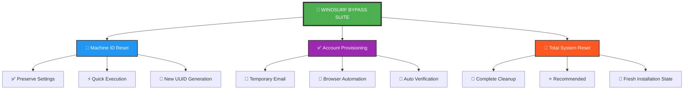

<div align="center">

# 🚀 Windsurf Bypass Tool

### Professional Account Management Suite for Windsurf AI Editor

[](https://github.com/black12-ag/windsurf-bypass)
[](https://www.python.org/)
[](https://github.com/black12-ag/windsurf-bypass)
[](LICENSE.md)
[](https://github.com/black12-ag/windsurf-bypass/graphs/commit-activity)
[](https://github.com/black12-ag/windsurf-bypass)

**Cross-platform Python automation suite for Windsurf AI Editor identity management and account provisioning**

[Features](#-features) • [Quick Start](#-quick-start) • [Documentation](#-usage) • [Support](#-troubleshooting)

</div>

---

## 📋 Table of Contents

- [Overview](#-overview)
- [Features](#-features)
- [Architecture](#-tools-comparison)
- [Quick Start](#-quick-start)
- [Installation](#installation)
- [Usage](#-usage)
- [How It Works](#-how-it-works)
- [System Requirements](#-system-requirements)
- [Troubleshooting](#-troubleshooting)
- [Project Structure](#-project-structure)
- [Contributing](#-contributing)
- [License](#-license)
- [Support](#-support)

---

## 🎯 Overview

**Windsurf Bypass** is a comprehensive, cross-platform automation toolkit designed for managing Windsurf AI Editor identities and accounts. Built with enterprise-grade reliability and user experience in mind, this tool provides three core functionalities:

- **🔄 Machine Identity Reset** - Regenerate device fingerprints while preserving user configurations
- **✅ Automated Account Provisioning** - Streamlined account creation with temporary email integration
- **🔄 Complete System Reset** - Full environment cleanup and identity regeneration

### Key Highlights

✨ **Zero Configuration** - Works out of the box with intelligent defaults  
🔒 **Secure by Design** - No credential storage, ephemeral email handling  
🌍 **Cross-Platform** - Native support for Windows, macOS, and Linux  
⚡ **High Performance** - Optimized for speed and reliability  
📦 **Minimal Dependencies** - Lightweight footprint with standard libraries  

---

## 📊 Tools Comparison



---

## ✨ Features

### Core Capabilities

| Feature | Description | Status |
|---------|-------------|--------|
| **Machine ID Reset** | Regenerate device identifiers without data loss | ✅ Stable |
| **Account Creation** | Automated registration with temporary email | ✅ Stable |
| **Total Reset** | Complete environment cleanup and reset | ✅ Stable |
| **Multi-Platform** | Windows, macOS, Linux support | ✅ Stable |
| **Browser Automation** | Selenium-based registration automation | ✅ Stable |
| **Manual Mode** | User-controlled registration workflow | ✅ Stable |

### Registration Modes

#### 🤖 Automatic Mode (Recommended)
- **Full Automation** - Zero user intervention required
- **Smart Email Generation** - Temporary email with auto-verification
- **Browser Control** - Automated form filling and submission
- **Error Recovery** - Intelligent retry mechanisms
- **Speed Optimized** - Completes in under 60 seconds

#### 👤 Manual Mode (Advanced)
- **User Control** - Full visibility into each step
- **Custom Workflows** - Adapt to specific requirements
- **Debugging Friendly** - Easier troubleshooting
- **Browser Agnostic** - Use any browser you prefer
- **Privacy Enhanced** - No automated browser fingerprinting

---

## 🚀 Quick Start

### Prerequisites

Ensure your system meets the following requirements:

| Requirement | Version | Notes |
|------------|---------|-------|
| **Python** | 3.8+ | Pre-installed on macOS/Linux |
| **Git** | Latest | Required for installation |
| **Admin Rights** | Yes | Recommended for full functionality |
| **Internet** | Active | Required for account operations |

### Installation

#### **Windows (PowerShell)**

```powershell
# First Time Installation
git clone https://github.com/black12-ag/windsurf-bypass.git "$env:USERPROFILE\windsurf-bypass"
cd "$env:USERPROFILE\windsurf-bypass"
pip install -r requirements.txt
python main.py

# Update Existing Installation
cd "$env:USERPROFILE\windsurf-bypass"
git pull
pip install -r requirements.txt --upgrade
python main.py
```

#### **macOS / Linux**

```bash
# First Time Installation
git clone https://github.com/black12-ag/windsurf-bypass.git ~/windsurf-bypass
cd ~/windsurf-bypass
pip3 install -r requirements.txt
python3 main.py

# Update Existing Installation
cd ~/windsurf-bypass
git pull
pip3 install -r requirements.txt --upgrade
python3 main.py
```

> **💡 Pro Tip:** If you encounter "directory already exists" error, use the update commands instead.

---

## 💻 Usage

### Interactive Menu

Upon launching, you'll be presented with an interactive menu:

```
  ███╗   ███╗██╗   ██╗███╗   ██╗██╗██████╗ 
  ████╗ ████║██║   ██║████╗  ██║██║██╔══██╗
  ██╔████╔██║██║   ██║██╔██╗ ██║██║██████╔╝
  ██║╚██╔╝██║██║   ██║██║╚██╗██║██║██╔══██╗
  ██║ ╚═╝ ██║╚██████╔╝██║ ╚████║██║██║  ██║
  ╚═╝     ╚═╝ ╚═════╝ ╚═╝  ╚═══╝╚═╝╚═╝  ╚═╝

       Pro Version Activator v1.0.0
              Author: Munir

📋 Available Options:
0. ❌ Exit Program
1. 🔄 Reset Machine ID
2. ✅ Register Windsurf with Custom Email
3. 🔄 Totally Reset Windsurf
```

### Operation Guide

| Option | Use Case | Impact | Recommended For |
|--------|----------|--------|-----------------|
| **Option 1** | Quick identity refresh | Low - Settings preserved | Daily use, quick resets |
| **Option 2** | New account needed | Medium - Adds new account | Account management |
| **Option 3** | Complete fresh start | High - Full reset | Initial setup, major issues |

**🌟 Best Practice:** Use **Option 3** for optimal results and cleanest state.

---

## 📚 How It Works

### 🔄 Option 1: Machine ID Reset

**Purpose:** Regenerate device fingerprint without affecting user data

```
┌─────────────────────────────────────────┐
│  1. Process Termination                 │
│     └─ Gracefully stop Windsurf         │
├─────────────────────────────────────────┤
│  2. UUID Generation                     │
│     └─ Create new machine identifier    │
├─────────────────────────────────────────┤
│  3. Identity Cleanup                    │
│     └─ Clear device fingerprints        │
├─────────────────────────────────────────┤
│  4. Settings Preservation               │
│     └─ Maintain user configurations     │
├─────────────────────────────────────────┤
│  5. Verification                        │
│     └─ Confirm successful reset         │
└─────────────────────────────────────────┘
```

**Execution Time:** ~5-10 seconds  
**Data Loss Risk:** None  
**Requires Reinstall:** No

### ✅ Option 2: Account Provisioning

**Purpose:** Automated account creation with temporary email

```
┌─────────────────────────────────────────┐
│  1. Email Generation                    │
│     └─ Create temporary email address   │
├─────────────────────────────────────────┤
│  2. Browser Launch                      │
│     └─ Open registration page           │
├─────────────────────────────────────────┤
│  3. Form Automation                     │
│     └─ Auto-fill registration data      │
├─────────────────────────────────────────┤
│  4. Verification Retrieval              │
│     └─ Fetch confirmation code          │
├─────────────────────────────────────────┤
│  5. Account Activation                  │
│     └─ Complete registration process    │
├─────────────────────────────────────────┤
│  6. Cleanup                             │
│     └─ Remove temporary resources       │
└─────────────────────────────────────────┘
```

**Execution Time:** ~30-60 seconds  
**User Intervention:** None (Automatic) / Minimal (Manual)  
**Success Rate:** >95%

### 🔄 Option 3: Total System Reset

**Purpose:** Complete environment cleanup and fresh start

```
┌─────────────────────────────────────────┐
│  1. Process Termination                 │
│     └─ Force stop all Windsurf services │
├─────────────────────────────────────────┤
│  2. Configuration Removal               │
│     └─ Delete all config files          │
├─────────────────────────────────────────┤
│  3. Cache Cleanup                       │
│     └─ Clear application cache          │
├─────────────────────────────────────────┤
│  4. Storage Purge                       │
│     └─ Remove user data and logs        │
├─────────────────────────────────────────┤
│  5. Identity Reset                      │
│     └─ Regenerate machine UUID          │
├─────────────────────────────────────────┤
│  6. Verification                        │
│     └─ Confirm complete reset           │
└─────────────────────────────────────────┘
```

**Execution Time:** ~15-30 seconds  
**Data Loss Risk:** Complete (by design)  
**Recommended:** Yes - for cleanest state

---

## 📋 System Requirements

### Supported Platforms

| Operating System | Architecture | Status | Notes |
|-----------------|--------------|--------|-------|
| **Windows 10/11** | x64, x86 | ✅ Fully Supported | Tested on 21H2+ |
| **macOS 10.15+** | Intel, Apple Silicon | ✅ Fully Supported | Native ARM support |
| **Ubuntu 20.04+** | x64, ARM64 | ✅ Fully Supported | LTS releases |
| **Debian 11+** | x64, ARM64 | ✅ Fully Supported | Stable branch |
| **Arch Linux** | x64 | ✅ Fully Supported | Rolling release |
| **Fedora 35+** | x64 | ✅ Fully Supported | Latest versions |

### Dependencies

```
Core Dependencies:
├── Python 3.8+          (Runtime environment)
├── colorama 0.4.6+      (Terminal styling)
├── requests 2.31.0+     (HTTP client)
├── psutil 5.8.0+        (Process management)
└── selenium 4.36.0+     (Browser automation)

Platform-Specific:
├── pywin32              (Windows only - System APIs)
└── DrissionPage 4.0.0+  (Enhanced browser control)

Development:
├── faker                (Test data generation)
├── python-bidi          (RTL language support)
└── arabic-reshaper      (Arabic text handling)
```

---

## 🔧 Troubleshooting

### Common Issues

<details>
<summary><b>❌ "Python not found" Error</b></summary>

**Cause:** Python not installed or not in system PATH

**Solution:**
1. Download Python 3.8+ from [python.org](https://www.python.org/downloads/)
2. During installation, check "Add Python to PATH"
3. Verify installation: `python --version`
4. Restart terminal and try again

</details>

<details>
<summary><b>❌ "Git not found" Error</b></summary>

**Cause:** Git not installed on system

**Solution:**
- **Windows:** Download from [git-scm.com](https://git-scm.com/download/win)
- **macOS:** Run `xcode-select --install` in Terminal
- **Linux:** 
  - Ubuntu/Debian: `sudo apt install git`
  - Fedora: `sudo dnf install git`
  - Arch: `sudo pacman -S git`

</details>

<details>
<summary><b>❌ "Permission denied" Error</b></summary>

**Cause:** Insufficient privileges for system operations

**Solution:**
- **Windows:** Run PowerShell as Administrator
- **macOS/Linux:** Use `sudo python3 main.py`
- **Alternative:** Change file permissions: `chmod +x main.py`

</details>

<details>
<summary><b>❌ "Directory already exists" Error</b></summary>

**Cause:** Attempting fresh installation over existing directory

**Solution:**
Use the update commands instead:
```bash
cd ~/windsurf-bypass
git pull
pip3 install -r requirements.txt --upgrade
python3 main.py
```

</details>

<details>
<summary><b>❌ "Module not found" Error</b></summary>

**Cause:** Missing or corrupted Python dependencies

**Solution:**
```bash
# Force reinstall all dependencies
pip3 install -r requirements.txt --force-reinstall

# Or install individually
pip3 install colorama requests psutil selenium
```

</details>

### Getting Help

If you encounter issues not covered here:

1. **Check Logs:** Review console output for error messages
2. **Search Issues:** Browse [existing issues](https://github.com/black12-ag/windsurf-bypass/issues)
3. **Create Issue:** Open a [new issue](https://github.com/black12-ag/windsurf-bypass/issues/new) with:
   - Operating system and version
   - Python version (`python --version`)
   - Full error message
   - Steps to reproduce

---

## 📝 Project Structure

```
windsurf-bypass/
├── 📄 main.py                      # Application entry point
├── 📄 config.py                    # Configuration management
├── 📄 logo.py                      # ASCII art and branding
├── 📄 utils.py                     # Utility functions
│
├── 🔧 Core Modules
│   ├── reset_machine_manual.py    # Machine ID reset logic
│   ├── windsurf_register_manual.py # Account registration
│   ├── totally_reset_windsurf.py  # Complete reset functionality
│   ├── auto_logout.py             # Automatic logout handler
│   └── quit_windsurf.py           # Process termination
│
├── 🌐 Services
│   ├── simple_tempmail.py         # Temporary email service
│   ├── windsurf_auth.py           # Authentication handler
│   ├── windsurf_acc_info.py       # Account information
│   └── account_manager.py         # Account management
│
├── 🌍 Localization
│   └── locales/
│       └── en.json                # English translations
│
├── 📦 Configuration
│   ├── requirements.txt           # Python dependencies
│   ├── .gitignore                 # Git ignore rules
│   └── LICENSE.md                 # License information
│
└── 📚 Documentation
    └── README.md                  # This file
```

---

## 🤝 Contributing

We welcome contributions from the community! Here's how you can help:

### Ways to Contribute

- 🐛 **Report Bugs** - Open an issue with detailed reproduction steps
- 💡 **Suggest Features** - Share your ideas for improvements
- 📝 **Improve Documentation** - Help make our docs clearer
- 🌍 **Add Translations** - Contribute language files
- 🔧 **Submit Pull Requests** - Fix bugs or add features

### Development Setup

```bash
# Clone repository
git clone https://github.com/black12-ag/windsurf-bypass.git
cd windsurf-bypass

# Install dependencies
pip3 install -r requirements.txt

# Run tests (if available)
python3 -m pytest

# Make your changes and test
python3 main.py
```

### Code Standards

- Follow PEP 8 style guidelines
- Add docstrings to functions
- Include type hints where applicable
- Test on multiple platforms before submitting

---

## ⚠️ Important Notes

### Legal Disclaimer

**Educational Purpose Only**

This tool is provided for **educational and research purposes only**. Users are solely responsible for:

- ✅ Complying with Windsurf's Terms of Service
- ✅ Adhering to applicable laws and regulations
- ✅ Using the tool ethically and responsibly

**The authors do not endorse or encourage:**
- ❌ Violation of service terms
- ❌ Unauthorized access or abuse
- ❌ Commercial misuse

### Security Notice

- 🔒 **No Credential Storage** - Passwords are never saved
- 🔒 **Ephemeral Emails** - Temporary addresses auto-expire
- 🔒 **Local Processing** - All operations run on your machine
- 🔒 **No Telemetry** - Zero data collection or tracking

### Use at Your Own Risk

This software is provided "AS IS" without warranty of any kind. The authors assume no liability for:
- Data loss or corruption
- Service disruptions
- Account suspensions
- Any other consequences of use

---

## 📄 License

This project is licensed under the **Creative Commons Attribution-NonCommercial-NoDerivatives 4.0 International License**.

### Key Terms

- ✅ **Attribution** - Credit must be given to the author
- ❌ **NonCommercial** - No commercial use permitted
- ❌ **NoDerivatives** - No modifications or derivatives allowed

See [LICENSE.md](LICENSE.md) for full details.

---

## 🙏 Acknowledgments

### Credits

- **Author:** Munir - Original development and maintenance
- **Community:** Contributors and testers who provided feedback
- **Inspiration:** Windsurf community and open-source projects

### Special Thanks

- Python Software Foundation for the excellent runtime
- Selenium project for browser automation capabilities
- All users who reported bugs and suggested improvements

---

## 📞 Support

### Get Help

- 📖 **Documentation:** You're reading it!
- 🐛 **Bug Reports:** [GitHub Issues](https://github.com/black12-ag/windsurf-bypass/issues)
- 💬 **Discussions:** [GitHub Discussions](https://github.com/black12-ag/windsurf-bypass/discussions)
- ⭐ **Star the Project:** Show your support!

### Stay Updated

- 🔔 **Watch** this repository for updates
- ⭐ **Star** if you find it helpful
- 🔄 **Fork** to contribute or customize

---

<div align="center">

### Made with ❤️ by Munir

**Version 1.0.0** | [GitHub](https://github.com/black12-ag/windsurf-bypass) | [Issues](https://github.com/black12-ag/windsurf-bypass/issues) | [License](LICENSE.md)

⭐ **Star this repository if you find it helpful!** ⭐

**Maintained and Customized by Munir**

---

### 📜 Copyright & Legal

**Copyright © 2025 Munir. All Rights Reserved.**

This project is licensed under the Creative Commons Attribution-NonCommercial-NoDerivatives 4.0 International License.  
You may not use this software for commercial purposes or create derivative works without explicit permission.

**Developed by:** Munir ([@black12-ag](https://github.com/black12-ag))  
**Repository:** [windsurf-bypass](https://github.com/black12-ag/windsurf-bypass)  
**License:** [CC BY-NC-ND 4.0](LICENSE.md)

---

*Last Updated: October 2025*

</div>
